# Lab 3: Automatic Emergency Braking

This lab is the first lab that you'll be working in teams. Each team member
will contribute their own implementation of the safety node and put them in
the same package.

## Learning Goals

- Use Time To Collision (TTC) to predict when the car is going to collide with
  an obstacle.
- Apply principles of a safety-critical system by applying safety measures
  (brakes) to prevent the system from going into an unsafe state.
- Learn about the `LaserScan` and `Odometry` messages in ROS 2.

## Lab Setup

We will build off the local file structure given in the first lab. Keep this
structure in mind while you are working through the instructions!

```
${HOME}
  |
  +-- lab1_ws/              -- Lab 1 Workspace folder
  |
  +-- lab2_ws/              -- Lab 2 Workspace folder
  |
  +-- lab3_ws/              -- Lab 3 Workspace folder (NEW)
  |
  +-- sim_ws/               -- Simulator Workspace folder
```

> **NOTE**: You may choose a different directory to substitute for ${HOME} for
> your setup; these commands will assume you are using ${HOME} for your setup,
> so adjust accordingly.

> **NOTE**: Keep in mind that `~` is always replaced with your home directory,
> so `${HOME}/some_dir` and `~/some_dir` are equivalent.

This lab is the first lab that you'll be working in teams. Each team member
will contribute their own implementation of the safety node and put them in
the same package. For example, if your teammates are `alice`, `bob`, and
`charlie`, your workspace folder would look like this:

```
${HOME}
  |
  +-- lab3_ws/
      |
      +-- src/
          |
          +-- aeb_pkg/
               |
               +-- aeb_pkg/
               |    |
               |    +-- alice_safety_node.py
               |    |
               |    +-- bob_safety_node.py
               |    |
               |    +-- charlie_safety_node.py
               |    |
               |    +-- YOURNAME_safety_node.py   -- Your safety node!
               |
               +-- launch/
               |    |
               |    +-- sim_launch.py
               |    |
               |    +-- veh_launch.py
               |
               +-- resource/
               |    :
               |
               +-- test/
               |    :
               |
               +-- package.xml
               |
               +-- setup.cfg
               |
               +-- setup.py
```

To start with the lab, clone the repository:

```bash
cd ~
git clone https://github.com/unlv-f1/lab3 lab3_ws
```

Then, mount ~/lab2_ws onto your Docker container (just as you've done for Lab 1) by putting an additional line in your ~/sim_ws/f1tenth_gym_ros/docker-compose.yml file:

```
- ~/lab3_ws/src:/lab3_ws/src
```

This lab already contains the base code that you need to get started.

## Part 1: Safety Node in the Simulator

### 1-1: Specification

Your team will be making a package named `aeb_pkg`, containing a node for each
member of your team, each named `<student>_safety_node` with `<student>`
replaced with each teammate's first name.

#### Launching

The base code located in this repository gives completed launch files and
installs them as data files already (so you don't need to modify the launch
files or add them as data files).

The launch file `sim_launch.py` has the following interface:

```
ros2 launch aeb_pkg sim_launch.py target:=<target_node> ttc_thresh:=<ttc_threshold>
```

For example, if you want to launch the node of a team member named `charlie`
with a TTC threshold of 1.0, the command would be:

```
ros2 launch aeb_pkg sim_launch.py target:=charlie_safety_node ttc_thresh:=1.0
```

The launch file will then run that specific node, passing the TTC threshold to
it.

#### Safety Nodes

Each team member has their own safety node. While running, the node
will calculate Time-to-Collision (TTC) based on the car's odometry and scan
data. If any TTC falls below the given TTC threshold (`ttc_thresh`), then the
car sends a drive message to `/drive`, stopping the car
(`msg.drive.speed = 0.0`).

#### Simulator Demonstration

You must be able to demonstrate that your code operates properly in the
simulator before testing it on the car.

For your demonstration, you will run your safety node with a TTC threshold of
`1.0`. It will consist of two tests:

* Have the car face a wall. Drive towards it using `teleop_twist_keyboard` at
  a speed of about `1.0`. Your safety node must brake before it collides with
  the wall.
* Have the car facing straight through one of the hallways in the `levine` map.
  Drive forward. Your car should not brake and make it to the end of the
  hallway.

### 1-2: ROS 2 Messages

This section will give an overview for some of the messages you'll need to
know about for this lab.

#### The `AckermannDriveStamped` Message

This is a message you've used in Lab 1.
[AckermannDriveStamped](http://docs.ros.org/en/jade/api/ackermann_msgs/html/msg/AckermannDriveStamped.html)
is the message that is used to send drive commands to the car in the simulator
and to the motors in real life. You can cause the car to brake by sending an
`AckermannDriveStamped` message with the `drive.speed` field set to `0.0`.

#### The `LaserScan` Message

This is a message you've used in Lab 2. The
[LaserScan](https://docs.ros2.org/foxy/api/sensor_msgs/msg/LaserScan.html)
message contains several fields that will be useful to us. You can see
detailed descriptions of what each field contains in the API. The one
we'll be using the most is the `ranges` field. This is an array that
contains all range measurements from the LiDAR radially
ordered. You'll need to subscribe to the `/scan` topic and calculate
iTTC with the LaserScan messages.

#### The `Odometry` Message

This is a new message that you'll be using in this lab.
Both the simulator node and the car itself publish
[Odometry](https://docs.ros2.org/foxy/api/nav_msgs/msg/Odometry.html)
messages. Within its several fields, the message includes the cars
position, orientation, and velocity. This will be useful for getting the speed
of the car.

The odometry topics vary between the simulator and vehicle:

* Simulator: `/ego_racecar/odom`
* Vehicle: `/odom`

This nuance is already covered by the launch files provided to you in this lab.
But it's important to keep this mind for future labs.

NOTE: The odometry data provided by `/ego_racecar/odom` is near-perfect
(providing almost the exact location where the car in in the simulator).
However, in real life, the odometry data from `/odom` will contain
inaccuracies.

### 1-3: TTC Calculation

**Time-to-Collision** (TTC) is the time it would take for the car to
collide with an obstacle if it maintained its current heading and
velocity. We approximate the time-to-collision using **Instantaneous
Time-to-Collision** (iTTC), which is the ratio of instantaneous range to
range rate calculated from current range measurements and velocity
measurements of the vehicle. Below is the formula for the iTTC:

$$
TTC_i(t)
= \frac{r_i}{\lbrace -\dot{r_i} \rbrace_{+}}
= \frac{r_i}{\max(\frac{d}{dt}r_i, 0)}
$$

where:

* $r$ is the instantaneous range measurement
* $\dot{r}$ is the current rate of change for that range measurement.

#### Getting Data from the Laser

First, you'll need to retrieve data from the laser. This is stored in the
`ranges` array. From here, you can calculate its angle using the calculations
you've derived from Lab 2.

#### Converting to the base frame

Now, the range and angles you have are in the **laser frame**, not the
**base frame.** Let $r_{laser}$ and $\theta_{laser}$ be the range and angle
in the laser frame. To calculate the coordinates to a point in the laser frame,
you'll take x and y components using the range and angle:

$$
x_{laser} = r_{laser} \cos(\theta_{laser})
$$

$$
y_{laser} = r_{laser} \sin(\theta_{laser})
$$

Afterward, you can perform your transformation to the base frame (assuming
no rotation):

$$
x_{base} = x_{laser} + x_t
$$

$$
y_{base} = y_{laser} + y_t
$$

where $x_t$ and $y_t$ are the x and y components of the translation vector for
the translation from laser to base.

From here, you'll need to find $r_{base}$ and $\theta_{base}$. Then $r_{base}$
may be calculated using the distance formula, and $\theta_{base}$ may be
calculated using the $\arctan$ function.

#### Calculating range rate $\dot{r}$

The range rate $\dot{r}$ is the expected rate of change along each scan beam.
A positive range rate means the range measurement is expanding, and a negative
one means the range measurement is shrinking.
Thus, it can be calculated in two different ways.

First, it can be calculated by mapping the vehicle's current
longitudinal velocity onto each scan beam's angle by using $v_x
\cos{\theta_{i}}$. Be careful with assigning the range rate a positive
or a negative value.

The angles could also be determined by the information in `LaserScan`
messages. The range rate could also be interpreted as how much the
range measurement will change if the vehicle keeps the current
velocity and the obstacle remains stationary.

Second, you can take the difference between the previous range
measurement and the current one, divide it by how much time has passed
in between (timestamps are available in message headers), and
calculate the range rate that way.

Note the negation in the calculation this is to correctly interpret
whether the range measurement should be decreasing or increasing. For
a vehicle travelling forward towards an obstacle, the corresponding
range rate for the beam right in front of the vehicle should be
negative since the range measurement should be shrinking.

Vice versa,
the range rate corresponding to the vehicle travelling away from an
obstacle should be positive since the range measurement should be
increasing. The operator is in place so the iTTC calculation will be
meaningful. When the range rate is positive, the operator will make
sure iTTC for that angle goes to infinity.

After your calculations, you should end up with an array of iTTCs that
correspond to each angle. When a time to collision drops below a
certain threshold, it means a collision is imminent.

### 1-4: Automatic Emergency Braking

When your car needs to brake, you'll send a drive message to `/drive` with a
speed of 0. Below is some example Python code which creates such a message:

```python
drive_msg = AckermannDriveStamped()
drive_msg.drive.speed = 0.0
```

### 1-5: Your Tasks

The base code provides launch files and a template safety node file for your
node named `student_safety_node.py`

For your first task, rename `student_safety_node.py` to
`<yourname>_safety_node.py`. Then, in `setup.py`, replace all instances of
`student` with your first name. (I recommend you rebuild your package and
launch to make sure it's correct.)

Then, in `<yourname>_safety_node.py`, there are several `TODO` comment tasks
to complete. You'll need to complete these tasks to implement the braking
functionality of the node.

### 1-6: Testing your Node

To test your node in the simulator, use `teleop_twist_keyboard` in a separate
terminal and have your node running at the same time. Use

```
ros2 launch aeb_pkg target:=YOUR_NAME_safety_node ttc_thresh:=1.0
```

to launch your node. In the simulator, you can teleport the car using **2D**
**Pose Estimate**. It is recommended that you do the two tests specified in
Section 1-1.

## Part 2: Getting onto the Car

The goal of this section is to get onto the vehicle itself.

### 2-1: Installing NoMachine

First, install [NoMachine](https://www.nomachine.com/). Upon successful
installation, starting the application will create a window like the following:


### 2-2: SSH

This section will teach you **one of the two** ways of getting on the car.
This way is terminal-based.

SSH stands for "Secure Shell", and it's a protocol which allows you to operate
a remote machine through the network. The `ssh` command in Linux is a
command-line utility which uses the SSH protocol. To install it, use the
following command **inside your container**:

```bash
apt-get install -y openssh-server
```

**NOTE**: You will need to install this every time you rebuild your container.
For convenience, you may add `openssh-server` as one of the dependencies
installed in your *Dockerfile*, so you don't need to run this every time you
rebuild.

Once installed, **switch to the same Wi-fi network** that the car is on. The
credentials of the network will be given during class.

Now, let's connect to the car. The syntax for the command is:

```bash
ssh USER_NAME@CAR_NAME
```

So, for example, if your user name is `fire_tires` and your car name is
`wally`, then the command would be:

```bash
ssh fire_tires@wally
```

Run the command for your user on your car. If it asks to continue connecting,
then say `yes`. Afterward, enter your user's password. On success, you'll be
greeted with something like:

```
Welcome to Ubuntu 20.04.6 LTS (GNU/Linux 5.10.120-tegra aarch64)

 * Documentation:  https://help.ubuntu.com
 * Management:     https://landscape.canonical.com
 * Support:        https://ubuntu.com/pro

This system has been minimized by removing packages and content that are
not required on a system that users do not log into.

To restore this content, you can run the 'unminimize' command.

Expanded Security Maintenance for Infrastructure is not enabled.

0 updates can be applied immediately.

136 additional security updates can be applied with ESM Infra.
Learn more about enabling ESM Infra service for Ubuntu 20.04 at
https://ubuntu.com/20-04

Last login: Thu Dec  4 01:30:21 2025 from fe80::182:c88f:912a:e9af%wlan0
sourced /opt/ros/foxy/setup.bash
sourced /home/f1/ws/install/local_setup.bash
```

**NOTE**: The `ssh` (and `scp`) command will sometimes fail and result in the
following error message. You may have to re-enter the command multiple times
for it to work.

```
ssh: connect to host vader port 22: Invalid argument
lost connection
```

Explore what files exists in your user using `ls` and `cd`. Below is part of
the file structure that is on the car:

```
${HOME}
  |
  +-- ws/
      |
      +-- build/
      |
      +-- install/
      |
      +-- log/
      |
      +-- src/       -- System nodes and your nodes go here!
```

NOTE: Remember that you'll always use `colcon build` in `ws/`.

### 2-3: NoMachine

This section will teach you the second of the two ways of getting on the car.
This way uses the desktop running on the car itself.

**NOTE: Only one user may be on the car at the same time with NoMachine.**
This is because the car itself only runs a single desktop instance. However,
you can have several SSH connections to the car.

First, click on "Add" to add a new connection:

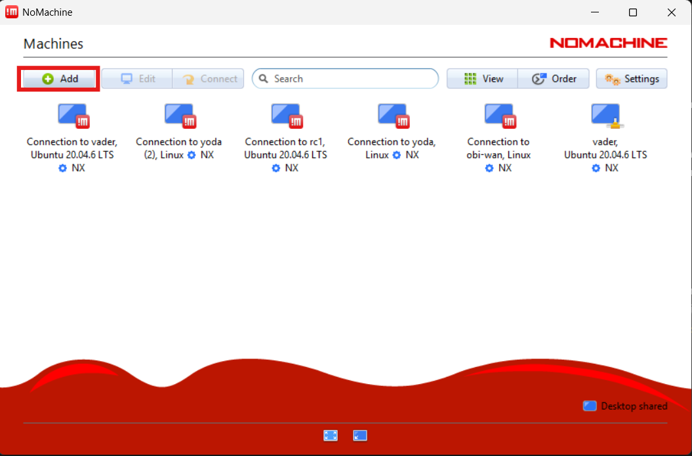

Then, add the host name. If your car's name is `vader`, then you would enter
`vader` for the host. If the car's name doesn't work, use its IP address.

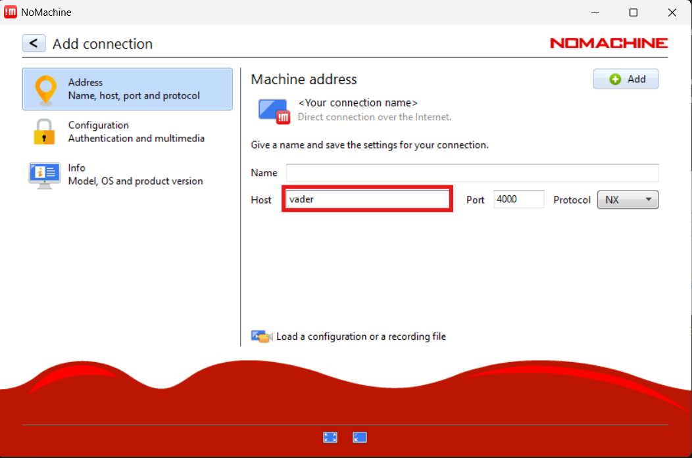

Adding a name is optional. Then click "Add" to add the connection.

Next, double-click the new machine.

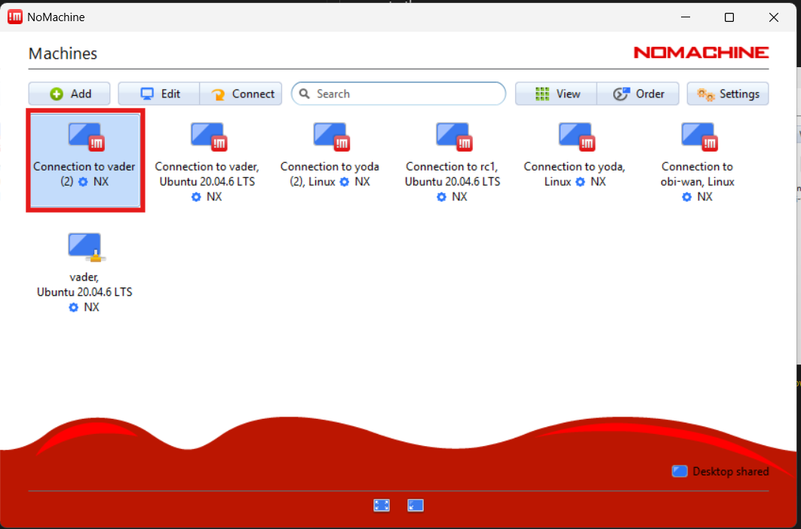

If successful, it will bring you to a login page. Enter your credentials.

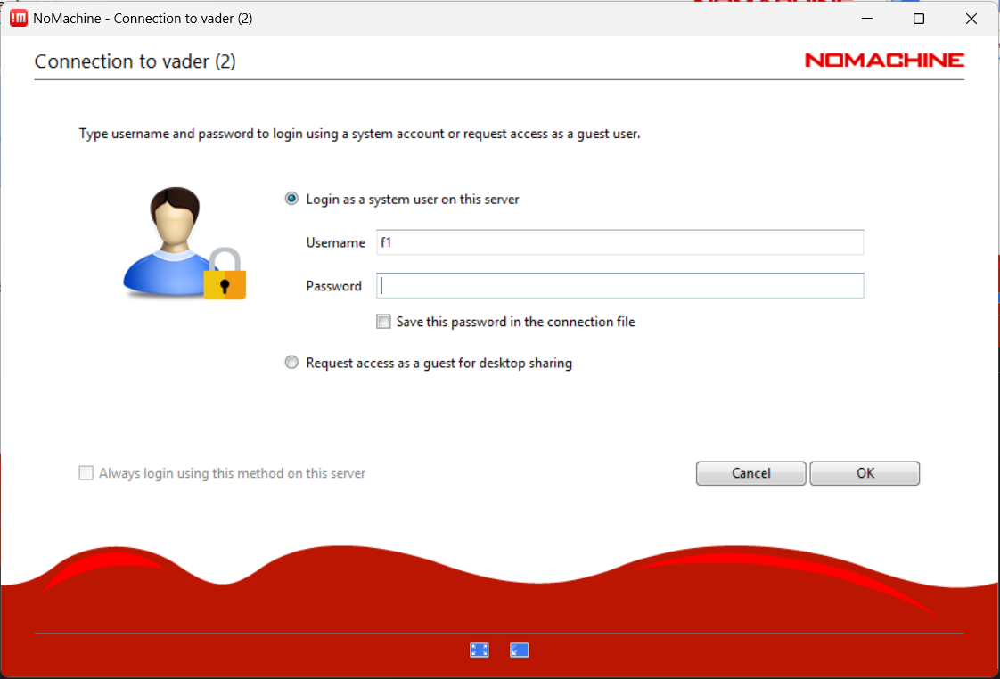

Then press "OK". On success on first startup, several new information pages
will appear. You may skip through all of these.

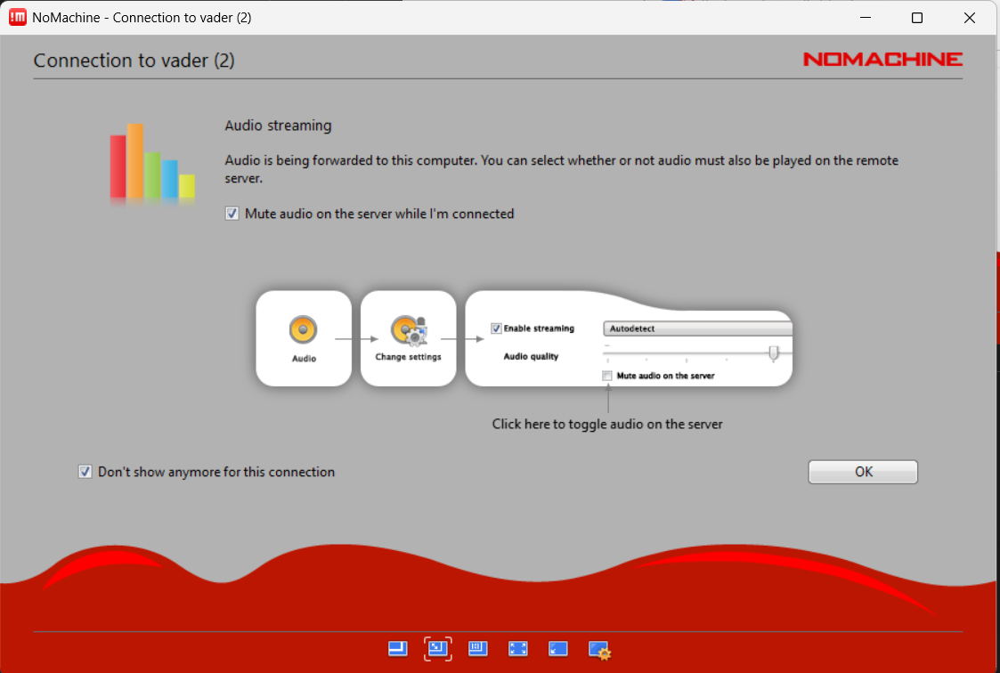

This will bring you to the login page. Select your user and enter in your
password.

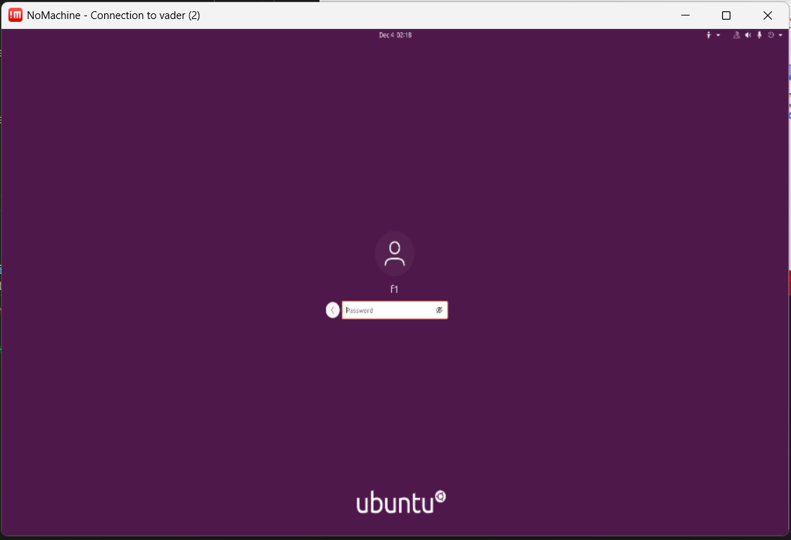

Once you do, you'll be able to access the desktop! (It may take a few minutes
to load.)

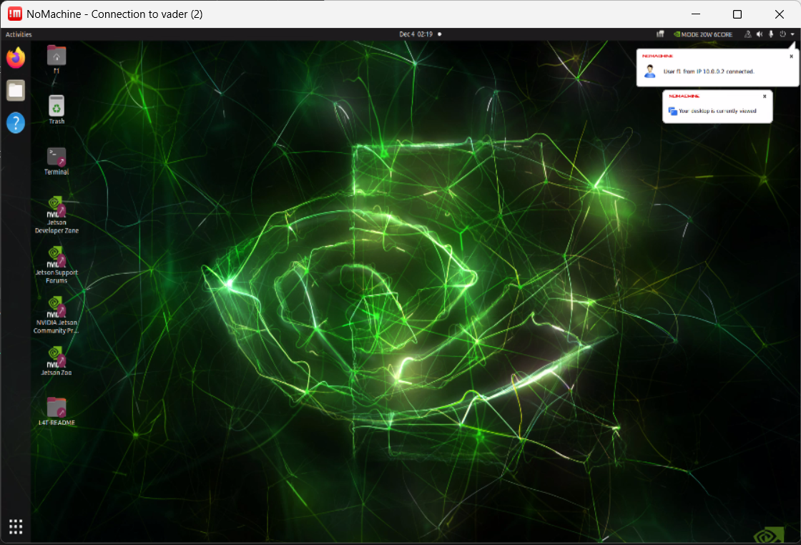

Click on the "Terminal" to open a new terminal. You can use commands here in
the same way you use them in a terminal in the simulator container!

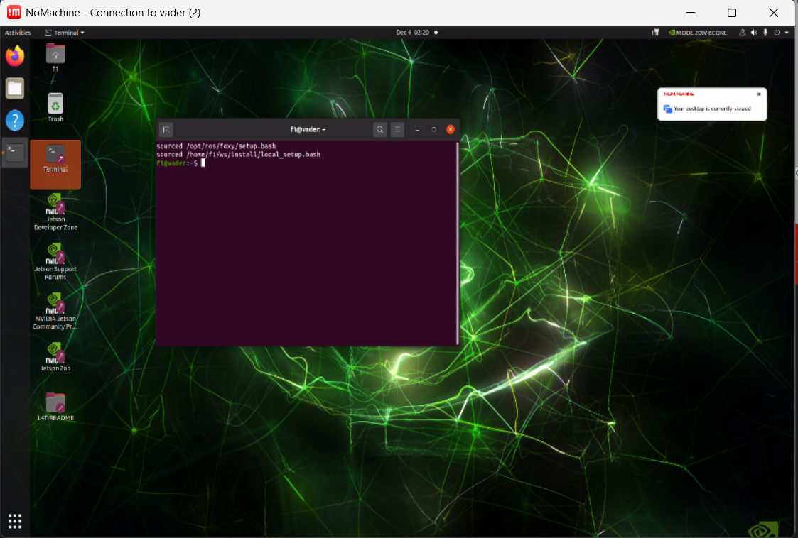

One good command to know is `rviz2`. This is the same program which provides
visualization for your simulator.

```bash
rviz2
```

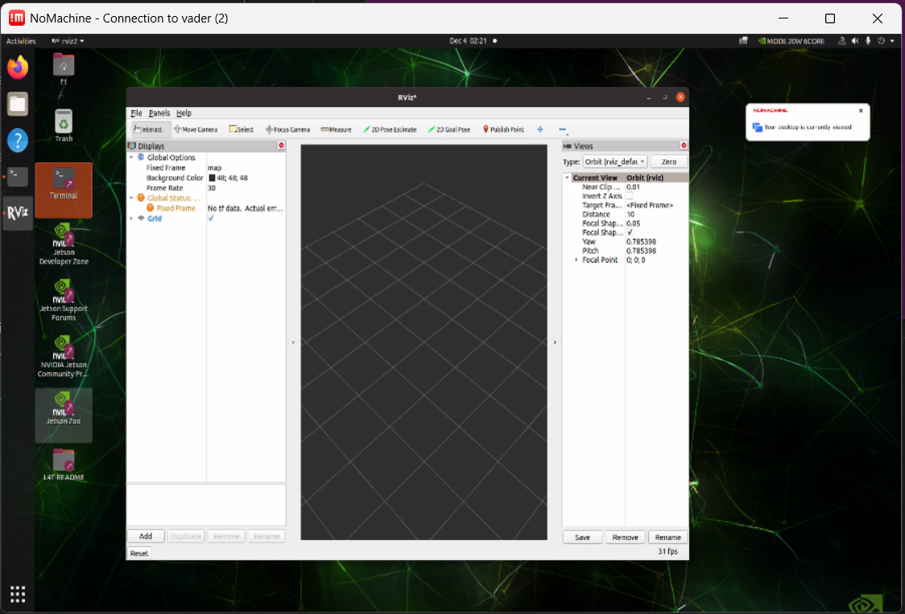

### 2-4: SCP

`scp` stands for "SSH copy" and is the SSH version of your `cp` command. It
behaves very similarly to your `cp` command, but the difference is that either
the source or destination of the command can be remote.

Below is the syntax for the `scp` command:

```
scp [-r] SOURCES... TARGET
```

If you want to transfer one or more files/directories onto the car, `TARGET`
becomes:

```
USER_NAME@CAR_NAME:TARGET_DIRECTORY_OR_FILE
```

Let's use a test file as an example. Go into your `/sim_ws` folder and create
an empty test file:

```
cd /sim_ws
touch test.txt
```

Then, to transfer it onto a user named `fire_tires` on the car `walle` into its
`~/ws` directory, the command would be:

```bash
scp test.txt fire_tires@walle:~/ws
```

On success, it'll show something like the following:

```
test.txt                                                                                                      100%    0     0.0KB/s   00:00
```

Let's check that it's on the car. Use SSH to get on the car:

```bash
scp test.txt USER_NAME@CAR_NAME
```

Then, navigate and see that it's there:

```
cd ~/ws
ls
```

`ls` should have `test.txt` in its list.

### 2-5: Running the Stack

In this section, we will run the stack on the car and test manual control.

First, connect to the car using **NoMachine**.

Then, we'll connect to the controller. Turn on the controller by pressing the
PS button. When it's connected, the light on the top of the controller will
glow a solid color.


Then, we'll run a stack. Run a new terminal and enter the following:

```
ros2 launch f1tenth_unlv_veh stack_launch.py
```

On success, you should see something like the following:

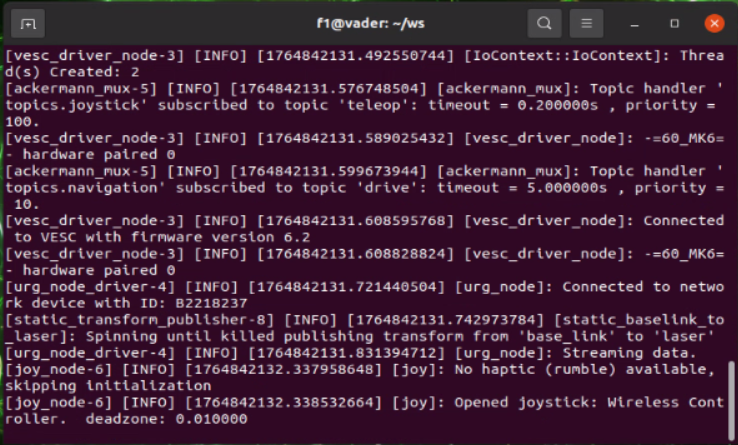

The message `Opened joystick...` means that the joystick controller has
connected.

To manually control the car, you must hold down the **Left Bumper** (L1) to
activate manual control. While holding L1 down, use the **Left Stick** to
go forward/backwards, and use the **Right Stick** to control the servos to
steer left and right.

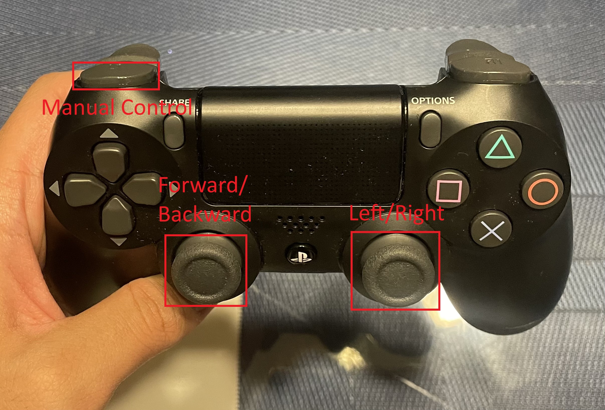

**NOTE**: If the car is steering left when the L1 is held, use `Ctrl+C` to stop
the stack and relaunch it with a new argument `manual_steer_axis:=2`. This is
needed because certain controllers map to different axes.

After this, stop the stack.

### 2-6: Running Your Lab 1 Package

Now, we'll try to run your Lab 1 package on the car. First, use `scp` to put
your lab1_pkg on the car:

```bash
cd /lab1_ws/src
scp -r lab1_pkg USER_NAME@CAR_NAME:~/ws/src
```

Then, get on the car using SSH or NoMachine, and build the package
specifically.

```bash
cd ~/ws
colcon build --packages-select lab1_ws
source install/local_setup.bash
```

**NOTE**: It's recommended to use `--packages-select` to avoid building all of
the packages in the workspace. (It may take a minute to build all of the
packages.)

Then, launch the stack:

```bash
ros2 launch f1tenth_unlv_veh stack_launch.py
```

Then, in a new terminal, launch your package:

```bash
ros2 launch lab1_pkg lab1_launch.py v:=1.5 d:=0.0
```

Now, your talker node should be posting to the `/drive` topic. However, it will
not run yet because the system hasn't activated autonomous control yet. To do
this, hold down the **Right Bumper** on the controller.

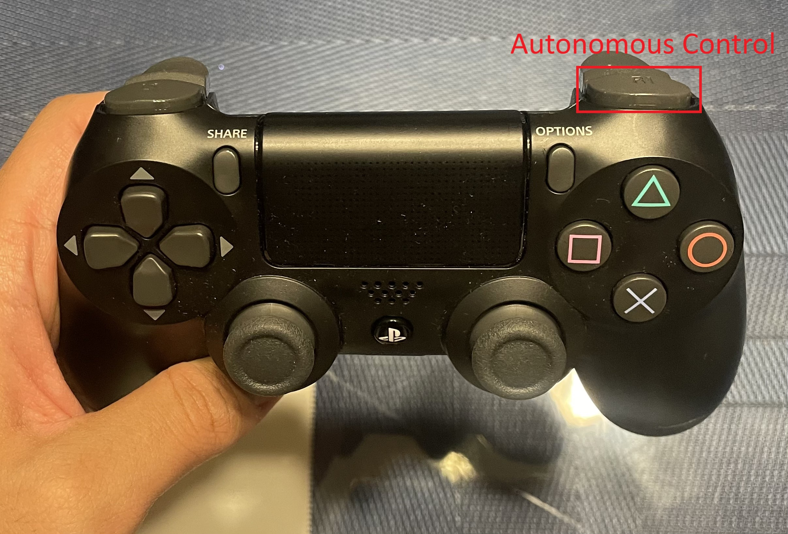

Once held, this will forward whatever's being sent through `/drive` and make
the car drive.

### 2-7: Running Your Safety Node

Finally, we'll put your `aeb_pkg` on the car. Make sure all of your team
members' nodes are in your package. Then `scp` it onto the car:

```bash
cd /lab3_ws/src
scp -r aeb_pkg USER_NAME@CAR_NAME:~/ws/src
```

Afterward, build it:

```bash
cd ~/ws
colcon build --packages-select aeb_pkg
source install/local_setup.bash
```

Then, launch the stack. We will be use a **different** launch file named
`stack_aeb_launch.py`.

```bash
ros2 launch f1tenth_unlv_veh stack_aeb_launch.py
```

This is needed because we need to switch the priorities of manual and
autonomous driving. So, any messages sent to `/drive` will override any manual
controls.

Then, in a new terminal, launch your package:

```bash
ros2 launch aeb_pkg veh_launch.py target:=STUDENT ttc_thresh:=2.0
```

In your team's demonstration, we will test each of your team members' nodes
with a TTC threshold of 2.0. If there are too many false positives caused by
the surrounding walls, then we may lower the TTC threshold.

For your demonstration, you'll drive forward towards an obstacle. If your car
stops before hitting the obstacle, you'll receive full points for your vehicle
demonstration.

## Grading Rubric

### Individual

- Student Simulator Demo: **30** Points
- Student Vehicle Demo: **30** Points

### Group

- All code consolidated into a single repository: **40** Points

### Total: 100pts
